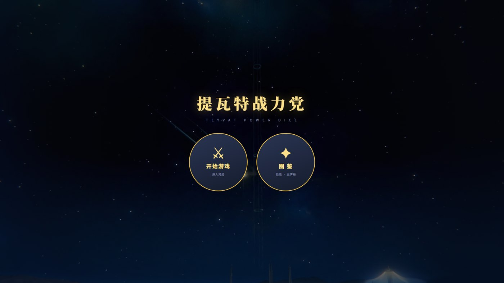
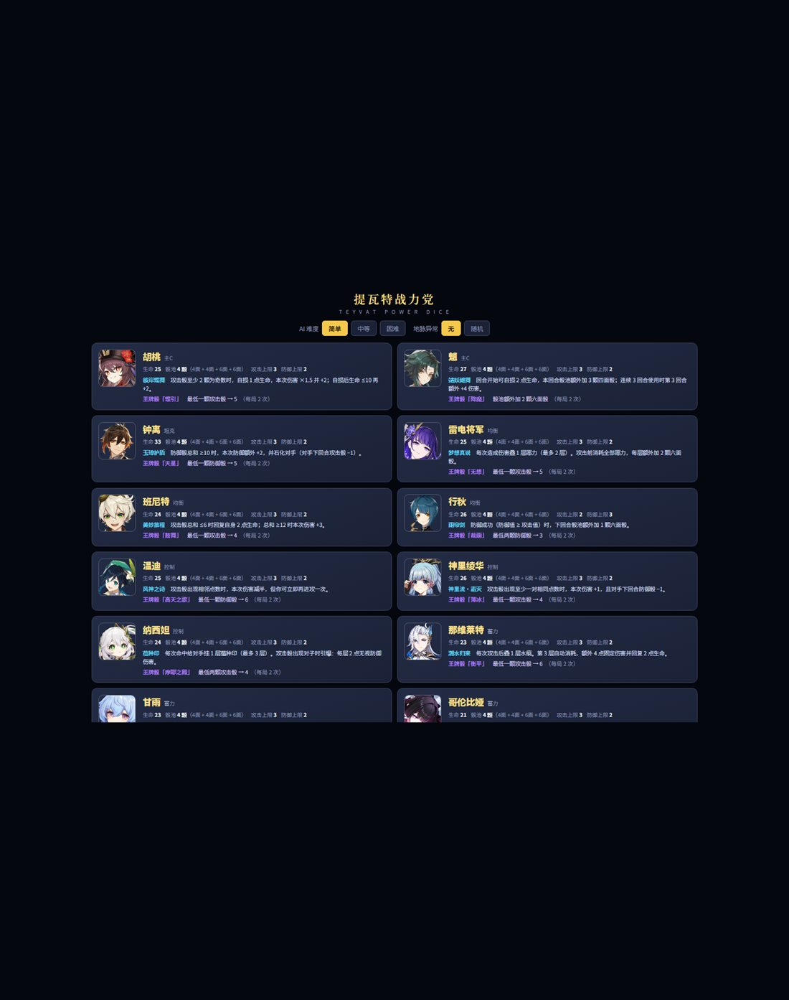
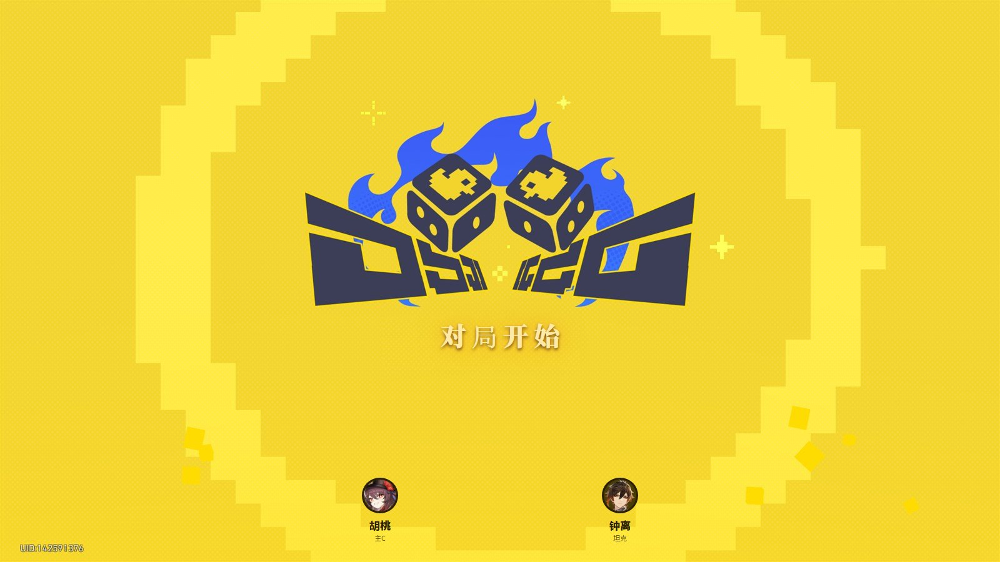
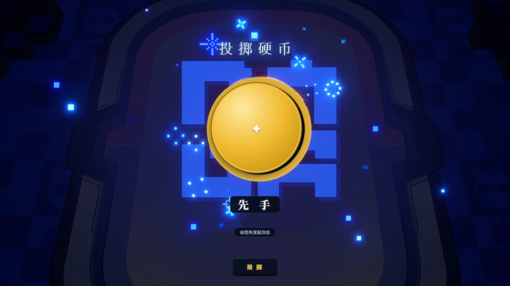
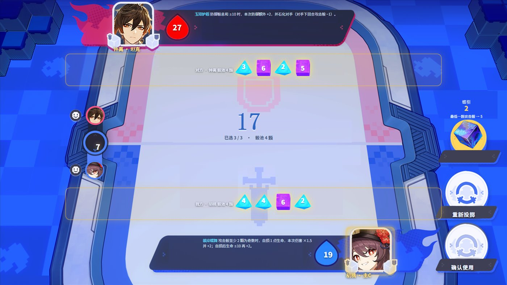
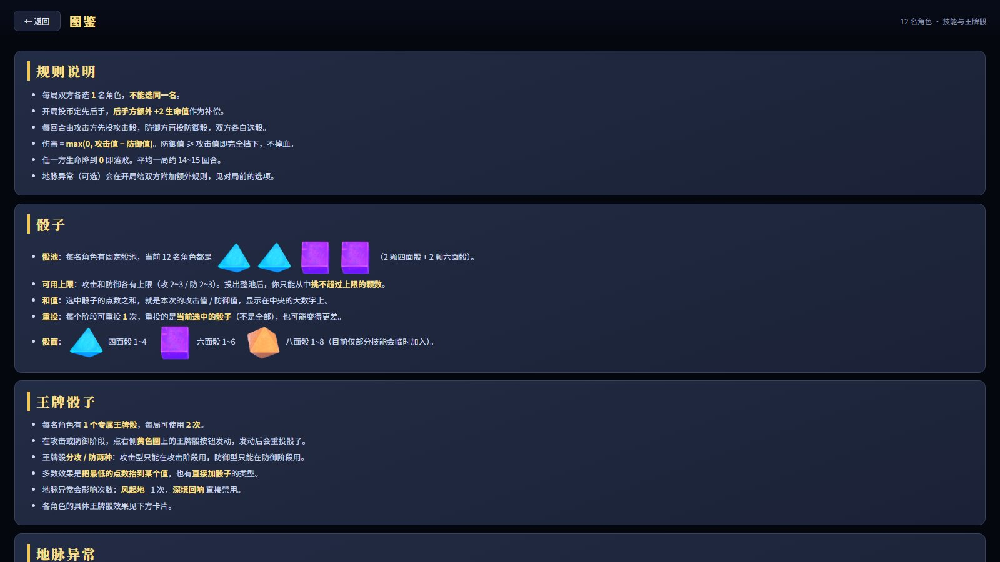
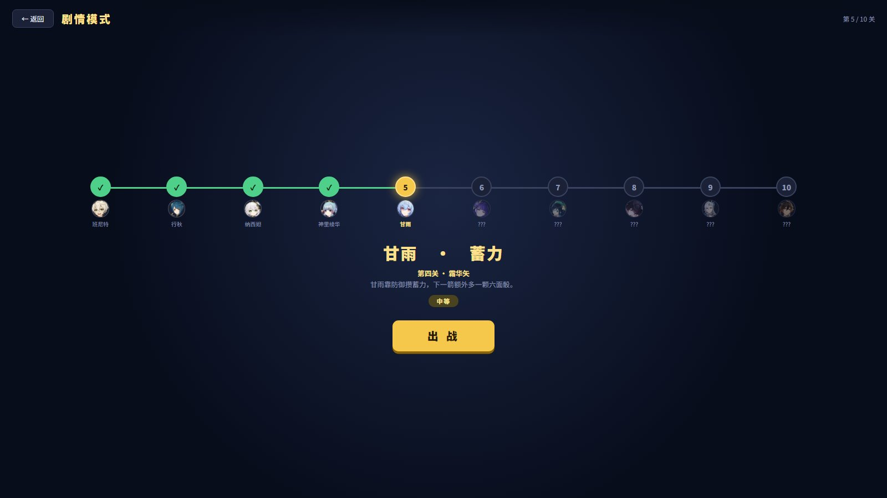

# 提瓦特战力党 · Teyvat Power Dice

> 一款单文件、零依赖、纯前端的骰子对战小游戏。
> A single-file, zero-dependency dice battler that runs entirely in the browser.

打开 `index.html`（或自包含的 `开始游戏.bundle.html`）即可开玩 —— **不需要服务器、不需要联网、不需要构建**。

Open `index.html` (or the self-contained `开始游戏.bundle.html`) and you're playing —
**no server, no network, no build step.**

## 画面 · Screens

| | |
|---|---|
|  |  |
| **菜单** — 入口 / 图鉴<br>Menu | **选卡** — 12 名角色与难度、地脉设置<br>Character select |
|  |  |
| **开局** — 双方对阵<br>Match start | **投币** — 决定先后手<br>Coin toss |
|  |  |
| **棋盘** — 红蓝双方半场各自显示骰子<br>The board | **图鉴** — 规则 / 骰子 / 王牌骰 / 地脉<br>Codex |
|  | |
| **剧情模式** — 10 关进度条与后续敌人预告<br>Story mode | |

---

# 中文

## 两分钟上手

1. **入口页** → 开始游戏
2. **模式页** → 自由对战 / 剧情模式
3. **选角色** → 12 名角色任选，AI 会随机取一名**不同**的角色
4. **对局开始** → 投币决定先后手（后手方 +2 生命）
5. **开打** —— 攻击方先投攻击骰，防御方再投防御骰

## 核心循环

```
投出整池骰子 → 从里面挑不超过上限的颗数 → （可重投一次 / 可发动王牌骰）
     → 确认 → 攻击值 − 防御值 = 伤害 → 换边
```


- **伤害** = `max(0, 攻击值 − 防御值)`。防 ≥ 攻就是完全挡下，一滴不掉。
- **重投**重投的是**当前选中的骰子**，不是全部，也可能变得更差。
- 平均一局 **14~15 回合**。

## 玩法要素

| 系统 | 说明 |
|---|---|
| **骰池** | 每名角色有固定骰池（当前 12 名统一为 2×D4 + 2×D6） |
| **可用上限** | 攻/防各有上限，投出整池后只能挑不超过上限的颗数 |
| **重投** | 每阶段 1 次，重投选中骰子 |
| **王牌骰** | 每角色 1 个专属技能骰，每局 2 次，分攻/防两种 |
| **地脉异常** | 可选规则：地脉平涌 / 岩脉共振 / 风起地 / 深境回响 |
| **图鉴** | 游戏内查看规则、骰子、王牌骰、地脉异常与全部 12 张角色卡 |
| **剧情模式** | 10 关固定编排，难度 简单 → 中等 → 困难 → 疯狂 |


## 角色

胡桃 · 魈 · 钟离 · 雷电将军 · 班尼特 · 行秋 · 温迪 · 神里绫华 · 纳西妲 · 那维莱特 · 甘雨 · 哥伦比娅

每名角色都有独立的**被动技能**和**王牌骰**（设计上贴近原作人设）：

- **胡桃** — 攻击骰出现 2 颗以上奇数时自损生命，换取 1.5 倍伤害
- **钟离** — 防御骰总和 ≥10 时额外加防并石化对手，下回合削其攻击骰
- **行秋** — 防御成功后，下回合骰池多一颗骰子
- **温迪** — 攻击骰出现相邻点数时伤害减半，但可立即再攻击一次

完整说明见游戏内**图鉴**。

## 平衡

12 张卡经过 **每张卡 14400 局 × 2 难度 + 4 种地脉异常** 的蒙特卡洛校准，胜率全部落在 **45%~55%**：

| 难度 | 胜率区间 | 先手方胜率 | 平均回合 | 平局 |
|---|---|---|---|---|
| 简单 | 46.7% ~ 53.6% | 48.9% | 14.9 | 0 |
| 困难 | 48.3% ~ 53.1% | 48.8% | 14.1 | 0 |
| 疯狂 | 58% ~ 65%（对困难档） | | | |

先手方胜率被控制在 **50% 附近**（后手方开局 +2 生命作为补偿）。

---

# English

## Quick start

1. **Entry page** → Start Game
2. **Mode select** → Free Battle / Story Mode
3. **Pick a character** → choose any of 12; the AI randomly takes a **different** one
4. **Match start** → a coin flip decides who goes first (the second player gets +2 HP)
5. **Fight** — the attacker rolls attack dice, then the defender rolls defence dice

## Core loop

```
Roll the whole pool → pick up to your cap from what you rolled
   → (reroll once / spend your Ace Die) → confirm
   → attack value − defence value = damage → switch sides
```

- **Damage** = `max(0, attack − defence)`. If defence ≥ attack, the hit is fully blocked.
- A **reroll** rerolls **the dice you currently have selected** — not the whole pool.
  It can make things worse.
- An average match lasts **14–15 rounds**.

## Systems

| System | What it does |
|---|---|
| **Dice pool** | Every character has a fixed pool (currently 2×D4 + 2×D6 for all 12) |
| **Selection cap** | Attack and defence each have a cap; you pick at most that many from your roll |
| **Reroll** | Once per phase, rerolls the selected dice |
| **Ace Die** | One signature die per character, 2 uses per match, attack- or defence-only |
| **Leyline anomalies** | Optional modifiers: Surging Leyline / Resonant Stone / Windrise / Abyssal Echo |
| **Codex** | In-game reference for rules, dice, Ace Dice, leylines and all 12 character cards |
| **Story Mode** | 10 hand-authored stages, ramping Easy → Normal → Hard → Crazy |

## Characters

Hu Tao · Xiao · Zhongli · Raiden Shogun · Bennett · Xingqiu · Venti · Kamisato Ayaka ·
Nahida · Neuvillette · Ganyu · Columbina

Each has a unique **passive skill** and **Ace Die**, written to match their original character:

- **Hu Tao** — self-damages when 2+ attack dice are odd, trading HP for ×1.5 damage
- **Zhongli** — a defence total of ≥10 grants extra defence and petrifies the opponent
- **Xingqiu** — a successful block adds an extra die to the next round's pool
- **Venti** — consecutive attack values halve the damage but grant an immediate follow-up attack

Full text is in the in-game **Codex**.

## Balance

All 12 characters were tuned by Monte Carlo — **14,400 matches per character × 2 difficulties + 4 leylines** —
and every win rate lands inside **45%–55%**:

| Difficulty | Win-rate spread | First-mover win rate | Avg. rounds | Draws |
|---|---|---|---|---|
| Easy | 46.7% – 53.6% | 48.9% | 14.9 | 0 |
| Hard | 48.3% – 53.1% | 48.8% | 14.1 | 0 |
| Crazy | 58% – 65% (vs. Hard) | | | |

First-mover advantage is held near **50%** — the second player starts with +2 HP as compensation.

---

# 文件说明 · Files

```
index.html                  Entry page (the default entry for static hosting)
开始游戏.html                The game itself; images load from assets/ (edit & refresh)
开始游戏.bundle.html         Released build: every asset inlined as base64
LICENSE                     MIT (see the asset-licensing note inside)
assets/                     20 runtime assets (12 portraits + 4 backgrounds + 4 dice)
docs/                       Screenshots used by this README
tools/
  verify-html.mjs           Validates the SHIPPED code (syntax / DOM / balance / AI tiers)
  bundle.ps1                Builds the single-file release
  align-check.ps1           Draws the CSS boxes onto the background to check alignment
  sync-assets.ps1           Syncs 图片素材/ into assets/
  sync-repo.ps1             Mirrors the build into the git working copy
```

**两个版本的区别 · Two builds**

- `开始游戏.html` —— **开发用 dev**. Assets are linked, so editing a file in `assets/`
  and refreshing the browser shows the change immediately (cache-busted with a timestamp).
- `开始游戏.bundle.html` —— **发布用 release**. 5.1 MB, every image inlined as base64,
  **zero external dependencies**. Double-click and play; easy to share.

---

# 技术要点 · Technical notes

- **零依赖 · No dependencies** — no framework, no bundler, no npm.
  All logic lives in a single `<script>`.
- **16:9 全屏舞台 · 16:9 stage** — `#app` is locked to
  `min(100vw, 177.7778vh) × min(100vh, 56.25vw)`; non-16:9 windows get letterboxed.
  Everything is positioned in **stage percentages**.
- **`cqh` 单位 · `cqh` units** — sizes and font sizes use `cqh` (1% of stage height)
  instead of `vh`, so the layout never drifts when the window is resized.
- **3D 骰子翻滚 · 3D dice tumble** — `perspective` plus random three-axis `rotateX/Y/Z`,
  with squash-and-stretch on landing to sell the weight.
- **粒子攻击 · Particle attack** — 20 independent particles with randomised offsets and delays.
- **黑边填充** — 舞台锁定 16:9；视口不是 16:9 时，一层全屏背景用「当前画面的底图」模糊压暗铺满，黑边变成美术的自然延伸。`#bleed` 在每次切画面时重新指向对应底图。
- **无障碍 · Accessibility** — respects `prefers-reduced-motion`; all animation is disabled
  when the OS "reduce motion" setting is on.

## 验证 · Verifying

```bash
node tools/verify-html.mjs
```

It extracts the script from the **actual shipped HTML** and runs it — not a copy —
so it validates exactly the code you play.

它会从**实际发货的 HTML** 里抽取脚本执行 —— 不是跑一份副本，所以验的就是你玩到的那份代码。

---

# 授权 · License

**代码以 [MIT](LICENSE) 授权 · Code is MIT licensed.**
Free to use, modify and distribute.

**素材不是 · The assets are not.** Character portraits, board art, the coin-flip screen,
the start screen, the menu background and the dice sprites are derived from
*Genshin Impact* / *Honkai: Star Rail*, owned by **COGNOSPHERE PTE. LTD. (HoYoverse)**.
They are included for **personal, non-commercial use only**.

**如果要 fork 或二次发布 · If you fork or redistribute:** replace everything under `assets/`
with artwork you have the rights to use, or obtain permission from the rights holder.
Do not present this as an official product and do not sell it.

**字体 · Fonts:** Noto Sans SC / Noto Serif SC (i.e. Source Han Sans / Serif) by Adobe & Google,
**SIL Open Font License 1.1**, loaded from the Google Fonts CDN and not redistributed here.
The project itself contains no proprietary fonts.


---

# 素材替换指南 · Replacing the assets

想把这个项目换成自己的美术？**代码一个字都不用改**，只要替换 `assets/` 里的文件。

## 运行时素材清单

| 文件 | 尺寸 / 格式 | 用途 |
|---|---|---|
| `av-<id>.png` × 12 | 256×256 PNG（透明底最佳） | 角色头像，棋盘上下大头像 + 左侧小头像 + 图鉴 + 剧情进度条共用 |
| `bg-board.png` | 1600×900 PNG（**含 alpha**） | 棋盘背景。头像槽位要**挖空透明**，系统才透得出头像 |
| `bg-start.jpg` | 1600×900 JPG | 对局开始画面 |
| `bg-coin2.png` | 1600×900 PNG（**含 alpha**） | 投币画面。硬币槽位挖空 |
| `bg-menu.jpg` | 任意比例 JPG | 菜单背景（CSS 用 `cover` 裁切） |
| `die-d4 / d6 / d8.png` | 透明底 PNG，任意尺寸 | 骰子精灵图，点数由 HTML 叠在上面 |
| `die-ace.png` | 透明底 PNG | 王牌骰图标 |

头像的 `<id>` 对应关系：`hutao` `xiao` `zhongli` `raiden` `bennett` `xingqiu`
`venti` `ayaka` `nahida` `neuvil` `ganyu` `columb`。

## 两种工作流

**A. 直接改 `assets/`**（最快）

改完存盘 → **刷新浏览器**即可。游戏用 `?v=时间戳` 破缓存，不会读到旧图。

**B. 用 `图片素材/` 工作区**

把你的原图（可保留 2560×1440 等大尺寸）丢进 `图片素材/`，然后：

```powershell
tools\sync-assets.ps1      # 自动缩放/裁切并同步到 assets/
```

它会按约定名称取图（棋盘取 `03_*.png`、启动取 `00_*.png`、头像按中文名），
统一缩到 1600×900 / 256×256。

#### `图片素材/` 是什么

它是**你自己的素材工作区**，不是游戏的一部分：

- **游戏运行不读它** —— 运行时只读 `assets/`
- **不进仓库** —— 已在 `.gitignore` 里排除（它是 2560×1440 级原图，体积大且与发布无关）
- **唯一用途** —— 作为 `tools/sync-assets.ps1` 的输入源，把大图缩放/裁切后同步到 `assets/`

留着它的意义：**`assets/` 里是缩过的图（1600×900），原图只在这里**。
以后想重新裁切、或换成更大尺寸时，只有这里有源。删了不影响游戏，但素材就不可再生了。

#### 内部文件与对应关系

| `图片素材/` 里的文件 | 说明 | 同步到 |
|---|---|---|
| `03_棋盘_未选骰 (2).png` | 棋盘底板，2560×1440，**含透明挖空**（头像槽位） | `assets/bg-board.png`（1600×900） |
| `00_对局开始.png` | 对局开始画面，2560×1440 | `assets/bg-start.jpg`（1600×900） |
| `游戏菜单背景.png` | 菜单背景，1728×1080 | `assets/bg-menu.jpg` |
| `胡桃.png` `魈.png` `钟离.png` `雷电将军.png` `班尼特.png` `行秋.png` `温迪.png` `神里绫华.png` `纳西妲.png` `那维莱特.png` `甘雨.png` `哥伦比娅.png` | 12 名角色头像，256×256 | `assets/av-<id>.png` |
| `未标题-2.png` | 骰子表（八面 / 四面 / 六面，透明底 484×256） | `assets/die-d8.png` `die-d4.png` `die-d6.png` |
| `未标题-1.png` | 王牌骰图标，135×121 | `assets/die-ace.png` |
| `01_投币素材.png` | 投币画面，2560×1440，**含透明挖空**（硬币槽位） | `assets/bg-coin2.png`（1600×900） |

#### 投币画面的文字是代码渲染的

`assets/bg-coin2.png` 里的**「投掷硬币」四个字不在图上**，而是用 HTML 文本 + 开源字体
（Noto Serif SC / 思源宋体）渲染后压在画面上 —— 和「对局开始」四个字同样处理。

这么做是因为**原图上的字用的是闭源字体**，不能随项目分发。所以：

- 想改这四个字 → 改 HTML 里的 `<div class="coinTitle">投掷硬币</div>`
- 想改位置/大小/发光 → 改 `.coinStage .coinTitle` 的 CSS
- **不要在图上重新烤字**，否则又会引入闭源字体

`sync-assets.ps1` 会同步投币图（取 `01_*.png`）。

> 注意：`sync-assets.ps1` **不处理骰子和王牌骰**（它们的切图逻辑是一次性的，
> 需要按行列投影找内容带才能切准）。改骰子贴图请直接用新的透明 PNG 覆盖
> `assets/die-d4.png` / `die-d6.png` / `die-d8.png` / `die-ace.png`。
---|---|---|
| 1 个字 | `1.5cqh`（舞台高的 1.5%） | `top` 直接加减 `N×1.5`；`left` 加减 `N×1.5×0.5625`（16:9 换算） |
| 1 个骰子高 | `9.2cqh` | 骰子相关位移 |

---

# 增加人物指南 · Adding a character

角色是**纯数据驱动**的，加一个人物改 4 处 + 1 张图。

## 1. 加头像

把 `assets/av-<新id>.png` 放进去（256×256）。

## 2. 登记头像映射

```js
// 脚本里搜 const AVA_IMG
const AVA_IMG = {
  ...
  yourid:'assets/av-yourid.png',      // ← 加这行
};
```

顺手在 `AVA_COLOR` 里给它一个元素主题色（占位头像和降级显示用）：

```js
const AVA_COLOR = { ..., yourid:'#c2453a' };
```

## 3. 定义角色卡

搜 `const CARDS`，照着现有条目加一条：

```js
yourid:{ name:'角色名', role:'主C', hp:25, pool:[4,4,6,6], atkCap:3, defCap:2,
  skill:'技能名', skillText:'技能说明，会显示在横幅和图鉴里。',
  ace:'王牌骰名', aceText:'最低一颗攻击骰 → 5' },
```

| 字段 | 含义 |
|---|---|
| `hp` | 生命值。**这是最主要的平衡旋钮**——每 ±1 点约影响 2~3% 胜率 |
| `pool` | 骰池，面数数组。`[4,4,6,6]` = 2 颗四面 + 2 颗六面 |
| `atkCap` / `defCap` | 攻击/防御时**最多能选几颗**。改这个比改 hp 影响大得多 |
| `role` | 只影响显示（主C / 坦克 / 均衡 / 控制 / 蓄力） |

## 4. 定义王牌骰

搜 `const ACES`：

```js
yourid:{ type:'atk', kind:'lowTo', n:5 },
```

| 字段 | 可选值 |
|---|---|
| `type` | `'atk'` 只能攻击阶段用 / `'def'` 只能防御阶段用 |
| `kind` | `'lowTo'` 最低一颗抬到 n ／ `'lowTwoTo'` 最低两颗抬到 n ／ `'add'` 直接加 `n` 颗 `face` 面骰 |

例：`{type:'atk', kind:'add', n:2, face:6}` = 攻击时额外加 2 颗六面骰。

## 5. 如果技能需要新逻辑

纯数值型技能（加骰、抬点、加伤）**不用写代码**。要新机制的话：

- **结算期效果**（伤害、回复、挂状态）→ 在 `resolve()` 里加一个 `if (A.id==='yourid'){...}`
  的块，那里已经有 12 个角色的现成例子；行内 `ev.push(...)` 的文字会显示在棋盘提示区。
- **投骰前效果**（改骰池、加骰子）→ 在 `buildPool()` 里加。

## 6. 检查平衡

```bash
node tools/verify-html.mjs
```

它会跑 **39600 局 × 2 难度 + 4 地脉 + 疯狂档对比**，并列出每张卡的胜率。
**目标是让新角色落进 45%~55%**，超了就调 `hp`（微调）或 `atkCap`/`defCap`（大调）。

## 7. 打包

```powershell
tools\bundle.ps1    # 把新头像内联进单文件版
```

---

# Asset & character guide (English)

## Replacing assets

Everything lives in `assets/` and is referenced **by filename**, so you can swap the art
without touching a single line of code.

| File | Spec | Purpose |
|---|---|---|
| `av-<id>.png` × 12 | 256×256 PNG, transparent | Portraits — large board slots, small side slots, codex, story bar |
| `bg-board.png` | 1600×900 PNG **with alpha** | Board. Portrait slots must be **cut out transparent** |
| `bg-start.jpg` | 1600×900 JPG | Match-start screen |
| `bg-coin2.png` | 1600×900 PNG **with alpha** | Coin toss. The coin slot must be cut out |
| `bg-menu.jpg` | any ratio, JPG | Menu background (CSS `cover`) |
| `die-d4/d6/d8.png` | transparent PNG | Dice sprites; the number is overlaid in HTML |
| `die-ace.png` | transparent PNG | Ace Die icon |

Edit a file in `assets/` and **refresh the browser** — assets are cache-busted with a
timestamp, so you never see a stale image. If you keep large working files in `图片素材/`,
run `tools/sync-assets.ps1` to scale and copy them across. That folder is a private working
area -- the game never reads it, and it is excluded via `.gitignore` (see the table below for what
each file maps to). Note that `assets/bg-coin2.png` currently has **no regenerable source**: its
original was removed, so the script cannot rebuild it. The single-file release is
inlined, so re-run `tools/bundle.ps1` after changing art.

`bg-board.png` is not just any picture — it is a plate with **transparent cut-outs**, and
every UI element is positioned at measured stage percentages. Swap the plate and the
alignment breaks. Run `tools/align-check.ps1`: it draws every CSS box **onto the background
image** so you can see the offset at a glance.

## Adding a character

Characters are data-driven. Add a portrait plus four entries:

1. `assets/av-<id>.png` — 256×256 portrait
2. `AVA_IMG` — map the id to the file path (`AVA_COLOR` gives it a theme colour)
3. `CARDS` — stats and text:
   `{ name, role, hp, pool, atkCap, defCap, skill, skillText, ace, aceText }`
   `hp` is the main balance knob; `atkCap` / `defCap` (how many dice you may pick) move the
   needle far more.
4. `ACES` — `{ type:'atk'|'def', kind:'lowTo'|'lowTwoTo'|'add', n, face? }`

Pure numeric skills need **no code**. For new mechanics, add an `if (A.id==='yourid')` block
in `resolve()` (damage/heal/status) or `buildPool()` (pool changes) — 12 worked examples
already exist in both.

Finally run `node tools/verify-html.mjs` and tune until the new character lands inside
**45%–55%**, then `tools/bundle.ps1` to rebuild the single-file release.

---

# 致谢 · Credits

- 玩法灵感来自《崩坏：星穹铁道》的「银河战力党」
  Gameplay inspired by *Honkai: Star Rail*'s "Galactic Battler"
- 字体 [Source Han Sans / Serif](https://github.com/adobe-fonts) — Adobe + Google, SIL OFL 1.1
